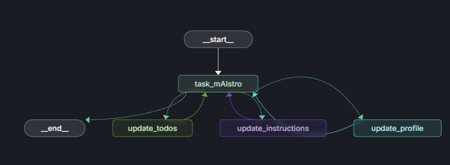

<!-- Banner -->
<p align="center">
  <a href="https://www.uit.edu.vn/" title="Trường Đại học Công nghệ Thông tin" style="border: none;">
    
  </a>
</p>

<!-- Title -->
<h1 align="center"><b>Machine Learning Operations</b></h1>

<!-- Main -->

# LangGraph Seminar: ToDo List Agent with Memory

## 1. Introduction

LangGraph is a powerful framework designed to enhance the development of AI-driven applications by providing structured workflows and agent interactions. This seminar focuses on building a ToDo List Agent with memory capabilities using LangGraph. The agent will be able to maintain both short-term context and long-term memory, allowing it to remember user preferences, tasks, and instructions across multiple interactions.

## 2. Agent & Agent with Memory

### Understanding the Role of Agents in LangGraph

Agents in LangGraph are autonomous entities that can perform tasks, make decisions, and interact with users or other agents. They are designed to handle complex workflows and can be enhanced with memory to maintain context across interactions.

Our agent, `task_mAIstro`, helps manage a ToDo list and can make decisions to update three types of long-term memory:

- Create or update a user `profile` with general user information 
- Add or update items in a ToDo list `collection`
- Update its own `instructions` on how to update items to the ToDo list

### Implementing Agents with Memory

To implement an agent with memory, we need to:

1. **Define the Memory Structure**: Create schemas to store different types of memories (e.g., user profile, tasks, instructions).
2. **Integrate Memory into the Agent**: Modify the agent to read from and write to memory during interactions.
3. **Manage Memory Updates**: Implement logic to decide when to save or update memories based on the conversation context.

## 3. Human in the Loop

### Integrating Human Input

Human input is crucial for enhancing the decision-making process of the agent. By integrating human input, we can:

* **Refine Task Details**: Allow users to provide additional details or modify tasks.
* **Update Preferences**: Let users change their preferences or instructions for task management.
* **Correct Errors**: Enable users to correct any mistakes made by the agent.

### Enhancing Decision-Making

Combining human expertise with AI automation ensures that the agent can make more informed decisions. For example, the agent can suggest local businesses for tasks and allow the user to select the most appropriate option.

## 4. Long - Short Term Memory

### Memory Types in Our Agent

Our agent, `task_mAIstro`, utilizes different types of memory:

1. **Semantic Memory**: Stores structured information about user profile and tasks.
2. **Procedural Memory**: Manages user preferences and instructions for creating ToDo items.
3. **Decision-Making Memory**: Decides when to save memories based on conversation context.

Unlike previous chatbots that always reflected on the conversation and saved memories, `task_mAIstro` will decide *when* to save memories (items to our ToDo list) and can save to either a user profile or a collection of ToDo items.

### State Schemas for Structured Memory

State schemas are used to manage the flow of data within the agent. For our ToDo List Agent, we define the following schemas:

* **User Profile Schema**: Stores personal information about the user (name, location, family members).
* **ToDo Collection Schema**: Maintains a list of tasks with details like deadlines, estimated time, and specific solutions.
* **Instructions Schema**: Stores user preferences for how to manage the ToDo list.

## 5. LangGraph Studio

LangGraph Studio offers a new way to develop LLM applications by providing a specialized agent IDE that enables visualization, interaction, and debugging of complex agentic applications. It allows you to better understand agent workflows and iterate faster.

### Features of LangGraph Studio

- **Visual Graphs**: See your agent's workflow visually represented
- **Interactive Debugging**: Step through execution node by node
- **State Editing**: Modify the state during execution to test different scenarios
- **Thread Management**: Create and manage multiple threads for testing
- **Human-in-the-Loop Testing**: Test your agent with human intervention points

### Using LangGraph Studio with Our ToDo Agent

To use LangGraph Studio with our ToDo List Agent:

1. Install the LangGraph CLI and start the development server:
   ```bash
   pip install --upgrade "langgraph-cli[inmem]"
   langgraph dev
   ```

2. Open LangGraph Studio in your browser or use the desktop application.

3. Connect to your project and visualize your agent's workflow.

4. Test your agent with different inputs:
   - "My name is Lance. I live in SF with my wife. I have a 1 year old daughter."
   - "My wife asked me to book swim lessons for the baby."
   - "When creating or updating ToDo items, include specific local businesses / vendors."

5. Add interrupts to walk through the agent execution step by step or interrupt at specific nodes.

6. Edit the state during execution to test different scenarios and fork threads to create alternative graph executions.

### Example Workflow



### Docker and Deployment of LangGraph Studio

LangGraph Studio relies on Docker for containerization, which provides a consistent development environment across different machines. Here's what you need to know about Docker and deployment:

#### Docker Requirements

- **Docker Engine**: LangGraph Studio requires Docker Engine to be running. Supported runtimes include:
  - Docker Desktop
  - Orbstack

- **Docker Compose**: Version 2.22.0 or higher is required

- **Local Services Access**: To access local services like Ollama or Chroma, you'll need to use `host.docker.internal` as the hostname instead of `localhost` since LangGraph Studio runs in its own Docker network.

#### Deployment Options

1. **Desktop Application** (macOS only):
   - Download the latest `.dmg` file from the [releases page](https://github.com/langchain-ai/langgraph-studio/releases)
   - Requires Docker Desktop or Orbstack to be running

2. **Web Version** (recommended for all platforms):
   - Run a local LangGraph server
   - Access via web browser
   - Works without Docker
   - Supports code hot-reloading
   - Shorter startup times

#### Project Configuration

LangGraph Studio requires a properly configured `langgraph.json` file in your project directory. This file specifies:
- Graphs to be loaded
- Environment variables
- Docker configuration

To customize your Docker environment, you can add instructions in the `dockerfile_lines` section:

```json
{
    "dockerfile_lines": [
        "RUN apt-get update && apt-get install -y gcc"
    ]
}
```

#### Troubleshooting

If you encounter issues with native dependencies during build, you may need to add additional packages to the Docker image through the `dockerfile_lines` configuration.

## Running the Demo

To run the demo, follow these steps:

0. Navigtate to the `demo` folder
```bash
cd demo
```
1. Install LangGraph CLI:
   ```bash
   pip install --upgrade "langgraph-cli[inmem]"
   ```

2. Install required dependencies:
   ```bash
   pip install -r requirements.txt
   ```

3. Set up environment variables in a `.env` file:
   ```
   GROQ_API_KEY=your_groq_api_key
   MODEL_NAME=your_model_name
   ```

4. Start LangGraph development server:
   ```bash
   langgraph dev
   ```

5. **Run Docker**: Ensure Docker is running before launching LangGraph Studio.

### Example Interactions

Try the following interactions to test the agent's capabilities:

* "My name is Lance. I live in SF with my wife. I have a 1 year old daughter."
  * *The agent will update the user profile with personal information.*

* "My wife asked me to book swim lessons for the baby."
  * *The agent will add a task to the ToDo list.*

* "When creating or updating ToDo items, include specific local businesses / vendors."
  * *The agent will update its instructions for creating ToDo items.*

* "I need to fix the jammed electric Yale lock on the door."
  * *The agent will add another task to the ToDo list.*

* "For the swim lessons, I need to get that done by end of November."
  * *The agent will update the swim lessons task with a deadline.*

* "I have 30 minutes, what tasks can I get done?"
  * *The agent will suggest tasks based on time estimates.*

* "Yes, give me some options to call for swim lessons."
  * *The agent will provide specific solutions for the swim lessons task.*

## Async Implementation

To ensure optimal performance when running in an ASGI web server, the agent code has been updated to use async/await patterns. This prevents blocking calls from degrading performance by:

1. Converting node functions to `async def`
2. Using `await asyncio.to_thread()` for potentially blocking operations:
   - Store operations (search, get, put)
   - Model inference calls
   - Trustcall extractor invocations

## Conclusion

The LangGraph framework provides a robust foundation for building AI-driven applications with structured workflows and agent interactions. By implementing a ToDo List Agent with memory, we can create a powerful tool that helps users manage their tasks efficiently while maintaining context across interactions. This seminar has covered the key concepts and steps required to build such an agent, from defining state schemas to integrating human input and managing long-short term memory.

LangGraph Studio enhances the development experience by providing powerful visualization and debugging tools, making it easier to understand and improve our agent's behavior.

## References

* LangGraph Documentation: [https://langgraph.ai/docs](https://langgraph.ai/docs)
* LangGraph GitHub Repository: [https://github.com/langgraph/langgraph](https://github.com/langgraph/langgraph)
* LangGraph CLI Installation Guide: [https://langgraph.ai/docs/cli](https://langgraph.ai/docs/cli)
* LangGraph Studio: [https://github.com/langchain-ai/langgraph-studio](https://github.com/langchain-ai/langgraph-studio)